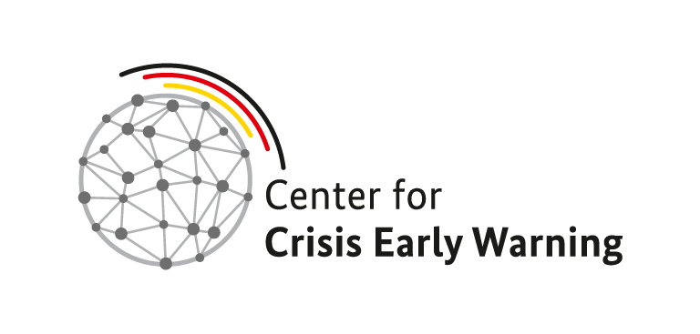

# Center for Crisis Early Warning Public Projects

The Center for Crisis Early Warning (CCEW) is located at the University of the Bundeswehr Munich. It is a multi-year project financed by the Federal Ministry of Defense and the Federal Foreign Office.

The main tasks of the Center are

- conducting quantitative crisis and conflict research using innovative conceptual and methodological approaches (predictive analytics),
- helping the above federal ministries to predict and assess crises and conflicts and thus to take appropriate preventive measures.

Find out more at https://www.unibw.de/ciss-en/ccew

  

